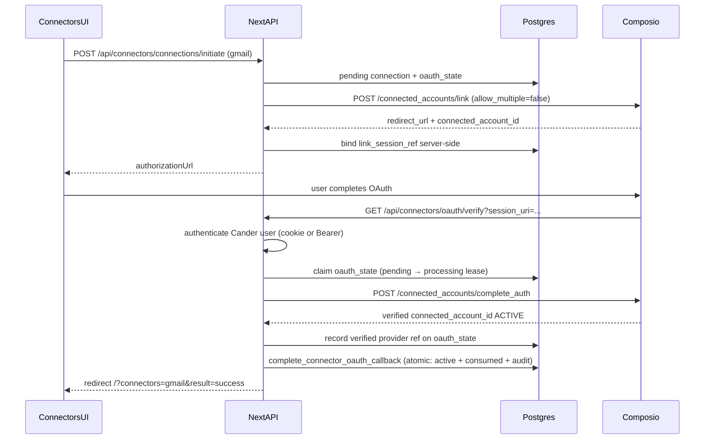

# Composio Gmail integration

Pinned SDK: `@composio/core@0.18.0` (see `package.json`).

## Official references

- [Callback identity verification](https://docs.composio.dev/reference/api-reference/connected-accounts#callback-identity-verification)
- [Connected Accounts v3 API](https://docs.composio.dev/reference/v3/api-reference/connected-accounts)
- [TypeScript ConnectedAccounts.link()](https://docs.composio.dev/reference/sdk-reference/typescript/connected-accounts)
- [TypeScript Triggers.parse() / verifyWebhook()](https://docs.composio.dev/reference/sdk-reference/typescript/triggers)

## Environment (server-only)

| Variable | Purpose |
|----------|---------|
| `COMPOSIO_API_KEY` | Composio project API key |
| `COMPOSIO_GMAIL_AUTH_CONFIG_ID` | Gmail auth config nanoid from Composio dashboard |
| `COMPOSIO_WEBHOOK_SECRET` | Webhook signature verification secret |
| `COMPOSIO_CALLBACK_VERIFIER_URL` | Fixed HTTPS verifier URL registered in Composio dashboard |

Never use `NEXT_PUBLIC_` for Composio secrets.

## Identity mapping

```
composio_user_id = "cander:" + workspaceId + ":" + profileId
```

Implemented in `lib/connectors/composio-identity.ts`.

Future workspace-shared mode (document only): `cander-shared:{workspaceId}`.

## OAuth flow (callback identity verification)



**Never** trust `status` or `connected_account_id` query params on the callback URL.

### OAuth state lifecycle

| Status | Meaning |
|--------|---------|
| `pending` | Awaiting callback; eligible for atomic claim |
| `processing` | Short-lived lease held while Composio `complete_auth` runs |
| `consumed` | Callback finished; state cannot be reused |
| `failed` | Verification failed; user must start a new authorization |

### Interrupted callback recovery (server-only)

If Composio redeems `session_uri` but Cander crashes before atomic completion:

1. `verified_provider_connection_id` is stored on the OAuth state while still `processing`.
2. After the processing lease expires, `list_recoverable_connector_oauth_states` surfaces the row.
3. Recovery (`lib/connectors/oauth-recovery.ts`) calls Composio `getStatus` server-side — never browser input or webhooks.
4. When the provider confirms `ACTIVE` and bindings match, `complete_connector_oauth_callback` finishes atomically.
5. If the provider is not active, the lease is released back to `pending` (retry) or marked `failed`.

**User outcome:** A successful Composio authorization can be completed on the next callback visit or background recovery without re-authorizing. Failed or unverifiable states require a new Connect flow.

Recovery does not expose provider references or account details to the browser.

## Fixed callback URLs

Register the exact verifier URL per environment in Composio dashboard (Settings → General → Configuration):

- Staging: `https://<staging-host>/api/connectors/oauth/verify`
- Production: `https://<production-host>/api/connectors/oauth/verify`

`COMPOSIO_CALLBACK_VERIFIER_URL` must match the dashboard value exactly.

Post-verification redirects default to `/` (signed-in app) with `connectors=gmail&result=…`. Allowlisted paths: `/`, `/work`, `/spaces` — no open redirects.

## Link-session binding

On `link()`:

1. Store `connected_account_id` as `link_session_ref` on `connector_oauth_states`.
2. Bind before returning `authorizationUrl` to the client.
3. Never expose `link_session_ref` in API DTOs, client cache, audit details, or logs.

## Disconnect

Provider revoke is confirmed before Cander transitions to `disconnected` (`lib/connectors/lifecycle.ts`).

## Webhooks

Route: `POST /api/connectors/webhooks/composio`

- Verify with `composio.triggers.parse(request, { verifySecret })` using the raw request body
- Signature format: `HMAC-SHA256(${webhook-id}.${webhook-timestamp}.${payload})` as `v1,base64`
- Idempotency via `connector_webhook_receipts` keyed on `webhook-id`
- Reconcile only connections with existing `provider_connection_id` binding
- Webhooks must not activate `pending` connections (callback identity verification only)

## Native clients

Electron and Capacitor shells load hosted web. OAuth return depends on cookie session on the same origin. Test web, desktop, and mobile return flows before enabling Gmail in catalog (see `docs/connectors/gmail-pilot-checklist.md`).

## Pre-implementation checklist

- [ ] Re-read Composio docs for `link()` and `complete_auth` response shapes
- [ ] Gmail auth config created in Composio dashboard
- [ ] Verifier URL registered and matches `COMPOSIO_CALLBACK_VERIFIER_URL`
- [ ] Webhook URL registered with secret
- [ ] Migrations `039`, `040`, and `041` applied on staging
- [ ] Staging isolation + callback replay probes pass

## Gmail enablement

Gmail remains `coming_soon` in `connector_catalog` until the full pilot checklist passes on staging.
