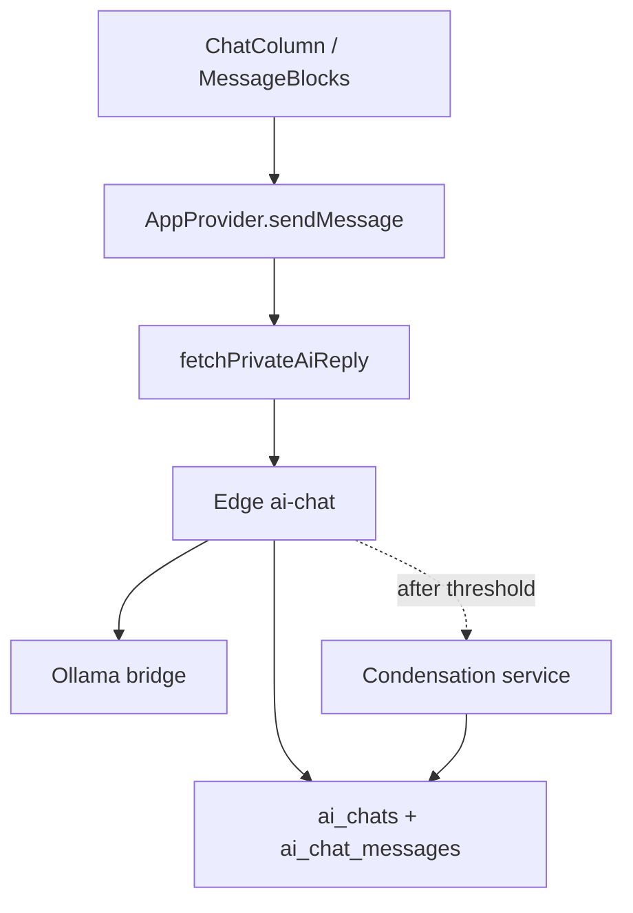

# Chat Response Rendering & Condensation

## Goal (~80–90%)

Make live AI chat feel like a polished product surface, not a raw LLM dump:

- Parsed Markdown → styled UI (no visible `**` / `###`)
- Concise default model behavior via system prompt
- Subtle **Thinking** pulse while waiting
- Long Space/project chats stay coherent via **incremental condensation** (not “summarize on every leave”)
- Thin **tool** and **streaming** shells for later — no live tool calling, no Edge SSE in this pass

**Out of scope this pass:** real MCP/tool execution, token streaming to the browser, rebuilding New Chat / Space navigation, redesigning the shell.

---

## What already exists (reuse)

| Concern | Today |
|---|---|
| UI transcript | [`ChatColumn`](components/shell/ChatColumn.tsx) → [`ChatMessage`](components/chat/MessageBlocks.tsx) |
| Message types | [`Message` / `ChatBlock`](lib/types.ts) |
| Live AI send | [`AppProvider.sendMessage`](components/app/AppProvider.tsx) → [`fetchPrivateAiReply`](lib/ai/send-thread-reply.ts) → Edge [`ai-chat`](supabase/functions/ai-chat/index.ts) |
| Space / project docks | [`lib/persistent-chat.ts`](lib/persistent-chat.ts) — already resume, not restart |
| New Chat | Home clears selection; **not** forced into a Space — keep that |
| UI “Last chat” blurb | `sessionSummary` / [`SessionSummaryBubble`](components/chat/SessionSummaryBubble.tsx) — **local mock only; not model context** |
| Bridge streaming | Exists on bridge; **unused** by Edge/UI — leave unused |



---

## Phase 1 — Response rendering + Thinking + compact prompt

### 1a. Rendering components

Add under `components/chat/`:

| Component | Role |
|---|---|
| `MarkdownRenderer` | Parse GFM → React (headings, bold, lists, links, code, tables, quotes) |
| `CodeBlock` | Fenced code; horizontal scroll on mobile |
| `TableBlock` | Responsive table; horizontal scroll when needed |
| `QuoteBlock` | Subtle left-border quote |
| `AssistantMessage` | Flush assistant turn; uses MarkdownRenderer; denser spacing |
| `UserMessage` | Keep current muted bubble; plain text (or light markdown) |
| `ThinkingIndicator` | Pulsing “Thinking” / animated dots — **not** chain-of-thought |
| `ToolCallBlock` | Shell only (Phase 3) |
| `CondensedContextIndicator` | “Chat condensed” divider (Phase 2) |

Refactor [`ChatMessage`](components/chat/MessageBlocks.tsx) to compose User/Assistant; keep existing `ChatBlock` cards (plan/build/connect/etc.).

**Formatting rules:** no raw Markdown characters; tight paragraph/list spacing; subtle headings; code/tables scroll on small screens; avoid giant vertical gaps (`gap-6` → slightly tighter for assistant body).

Add a small Markdown dependency (e.g. `react-markdown` + `remark-gfm`) rather than hand-rolling a parser.

### 1b. Thinking state

- Replace plain `"Thinking…"` content with a dedicated flag or empty content + `status: "pending"` / UI prop so ThinkingIndicator renders instead of markdown text.
- Soft pulse / cycling dots — no spinner.
- On reply: swap indicator → final formatted content (request/replace is fine this pass).

Keep sync guards in [`chat-sync.ts`](lib/api/chat-sync.ts) that skip hydrate while thinking is in flight (adapt to new pending marker if content string changes).

### 1c. Compact system prompt

In Edge `send_message`, always prepend a short **product** system message (before workspace context refs):

- Answer first; short paragraphs; high information density
- Avoid restating the question, unnecessary headings, and filler
- Expand when the question needs it
- Model may still emit Markdown; UI renders it

Keep existing shallow context-ref block as a second system segment when refs exist.

---

## Phase 2 — Automatic condensation (the real continuity win)

### Problem

Edge loads **all** `ai_chat_messages` into the model every turn. Long Space/project chats will blow context and quality. UI `sessionSummary` is not used for the model.

### Schema (new migration)

Extend `ai_chats`:

- `condensed_context` `jsonb` — structured summary object
- `condensed_through_sort_order` `int` — watermark of last condensed message
- `condensed_at` `timestamptz`

Structured shape (stored, not shown to user by default):

```
conversation_summary
current_state
decisions[]
open_tasks[]
important_entities[]
preferences_constraints[]
last_updated
```

Optional: allow `ai_chat_messages.role = 'system'` events with a marker content type, **or** a UI-only message kind `chat_event: "condensed"` mirrored into the workspace thread when Edge returns `condensation: { occurred: true }`.

Prefer: Edge returns `{ assistantMessage, condensation?: { occurred: true } }` and the client inserts a non-assistant transcript marker — avoids polluting model history with UI chrome. Persist condensation only on `ai_chats`; the marker is UI/sync metadata.

### Context assembly (every send)

```
[product system prompt]
+ [workspace/project context refs]
+ [condensed_context as compact system JSON/text]   // if present
+ [recent messages after watermark, capped ~N turns / ~token budget]
+ [current user message already in history]
```

Defaults (tunable constants in Edge):

- Recent window: last **16** messages (or ~4k chars) verbatim
- Trigger condensation when messages **beyond watermark** exceed **40** messages **or** ~12k chars
- On trigger: call bridge once with “update existing summary + new chunk” prompt; write new `condensed_context` + advance watermark
- **Do not** condense on Space leave alone — only threshold (leave still persists via existing chat sync)

### Leave / return

Already: Space/project docks resume the same thread + `aiChatId`. After condensation, return path naturally uses summary + recent window. No extra “condense on leave” job.

### UI marker

When `condensation.occurred`:

- Insert a subtle centered divider: `──── Chat condensed ────`
- Not an assistant bubble; no summary text shown
- Only when a real condensation ran

Component: `CondensedContextIndicator`.

---

## Phase 3 — Shells for later (minimal)

### ToolCallBlock

- Add `ChatBlock` variant: `{ type: "tool"; label: string; status: "running" | "done" | "error"; detail?: string }`
- Render compact status row (“Searching the web…” → “✓ Search complete”), expandable detail later
- **No** registry wiring, MCP, or model tool_calls this pass
- Export component so future agent loops can push blocks onto the assistant message

### Streaming

- Keep request/replace path
- Ensure message `status` (`pending` → `complete`) is consistent on UI + DTO
- Optional stub: `lib/ai/stream-types.ts` or comments at Edge/client seams documenting where SSE would plug in
- Do **not** implement Edge SSE or UI token paint this pass

---

## Architecture boundaries

```
Chat UI (ChatColumn)
  → Message renderer (Assistant/User/Markdown/Thinking/Tool shell/Condensed marker)
  → AppProvider send + patch
  → Chat service (ai-chat-api / fetchPrivateAiReply)
  → Edge ai-chat (prompt + context assembly + condensation)
  → Bridge / Ollama
```

Condensation lives in Edge (or a small shared module copied into the function) — **not** in React. UI only consumes `condensation.occurred`.

---

## Implementation order (one pass)

1. **Phase 1** — renderer + ThinkingIndicator + system prompt (visible win immediately)
2. **Phase 2** — migration + Edge context window + condensation + marker + client handling
3. **Phase 3** — ToolCallBlock shell + status typing cleanup

Ship on `main` when Phase 1+2 are solid; Phase 3 is small and rides along.

---

## Test plan

- Home New Chat: Markdown reply renders (bold/lists/code) without raw `**`
- Thinking pulses, then swaps to formatted reply (no stuck Thinking)
- Work/Build/Explore project Ask: same renderer + context refs still attach
- Long chat: after threshold, Network shows condensation once; transcript gets one “Chat condensed” marker; later turns still answer with prior decisions
- Leave Space / return: conversation resumes; no condensation spam on leave alone
- Mobile: code/tables scroll; Thinking/tool shells don’t blow padding
- Regression: plan/build/connect demo blocks still render; non-AI intents unchanged

---

## Explicit non-goals

- Live tool / MCP execution
- Token streaming to the browser
- Replacing New Chat with forced Space assignment
- Showing condensed summary text to the user by default
- Condensing on every Space leave
