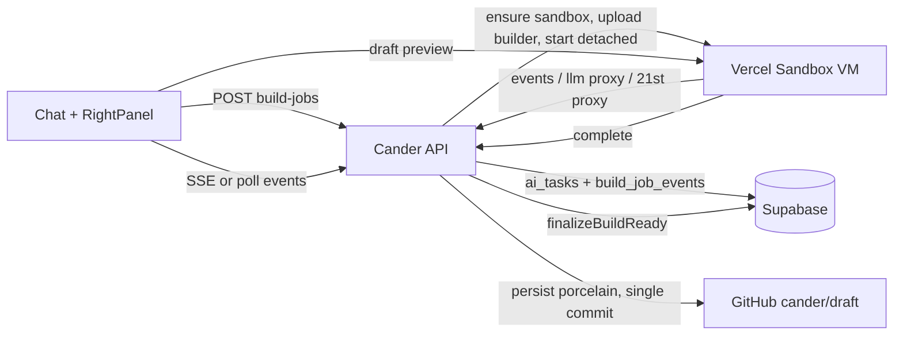

# Website Builder V2 — Phased Plan

**Status:** Approved 2026-09-09. Implementation tracked phase by phase below; rolled out behind `CANDER_BUILD_V2`.

## Target experience (what we are building toward)

1. Create project → named → chat (left) + right panel.
2. Setup popup, up to 8 questions (existing `WebsiteSetup` flow), user submits.
3. "Drafting your website, hang tight" screen. Backend autonomously: plans → fans out sub-agents (research, content, design, component retrieval from 21st.dev) → Codex writes the whole site → typecheck/build/self-verify → single commit to `cander/draft` → preview ready. Takes as long as it takes.
4. User sees the draft preview. Chat edits: "Okay, I will work on that" → progress → "Awesome, how is that now?" with refreshed preview. No VM recreate per edit.
5. Publish / Republish → subdomain or custom domain, SEO-complete, live.

## Why the current pipeline can't get there (from the audit)

- Pages come from the hardcoded template `composeSiteFromSpec` ([lib/ai/build/compose-site.ts](lib/ai/build/compose-site.ts)); the "essentials" block in [lib/ai/build/project-turn.ts](lib/ai/build/project-turn.ts) (~1220–1233) overwrites Codex's `app/page.tsx`, `app/layout.tsx`, `app/globals.css` after Codex wrote them.
- The coding loop runs in the browser tab, max 4 rounds, parses tool calls with regex, no file tree / tsc / screenshots.
- Two write channels (git-first scaffold vs sandbox + per-file persist) → 10–50 commits per create, binaries broken, lockfile skipped.
- Every edit recreates the VM (`build_state.draftSha` never updated after persist) and blows the 300s route cap.
- Every site message is forced through the edit pipeline with forced writes; five status machines disagree.
- 21st.dev works but is unconfigured locally and normalize is fragile. Publish/domains are in good shape.

## Architecture decision (confirmed)

Builder agent runs **inside the Vercel Sandbox** as a detached process (precedent: `detached: true` in [lib/computer/spike/agent-browser-bootstrap.ts](lib/computer/spike/agent-browser-bootstrap.ts)). Cander's server is a thin orchestrator; the sandbox does the long work. Rolled out behind `CANDER_BUILD_V2`, default flipped after Phase 3, legacy deleted in Phase 5.

Secrets never enter the sandbox: the builder calls Cander with a per-job HMAC token; Cander proxies OpenAI and 21st.dev (`API_KEY_21ST` stays server-side).

---

## Phase 0 — Stop the bleeding (current pipeline, ~1 day)

Small, safe fixes that immediately improve output without V2.

- In [lib/ai/build/project-turn.ts](lib/ai/build/project-turn.ts) essentials block: never overwrite `app/page.tsx`, `app/layout.tsx`, `app/globals.css`, `components/**` when Codex produced them; only fill missing config files (`package.json`, `next.config.mjs`, `tsconfig.json`, `robots.ts`, `sitemap.ts`).
- `emitGlobalsCss` in [lib/ai/build/design-system/tokens.ts](lib/ai/build/design-system/tokens.ts): include the Tailwind import so Codex's utility classes actually render.
- Raise `runCodingAgentLoop` `maxRounds` 4 → 12 and use the existing retry budgets.
- After persist, update `computer_sessions.build_state.draftSha` to the new commit so `ensureProjectSandbox` in [lib/build/sandbox/lifecycle.ts](lib/build/sandbox/lifecycle.ts) stops recreating the VM on every edit.
- Add `API_KEY_21ST` to `.env.local` (server-only) so retrieval is exercised in dogfood.
- In [lib/ai/build/edit-pipeline.ts](lib/ai/build/edit-pipeline.ts): drop the forced-write retry for messages classified as questions/chat; answer conversationally instead.

## Phase 1 — Builder runtime in the sandbox (the spine)

- **Job model**: reuse `ai_tasks` (kind `multi_step`, statuses `queued → running → verifying → ready_for_review | failed`). New migration `build_job_events(job_id, seq, kind, message, payload jsonb, created_at)` for the progress stream.
- **Builder package** `builder/` (bundled to a single `index.mjs`, uploaded with `sandbox.writeFiles`, started `detached: true`). Contents:
  - Agent loop on OpenAI Responses API with native tool calling (no regex). Tools: `list_tree`, `read_file`, `write_file`, `apply_patch` (reuse [lib/build/sandbox/apply-unified-diff.ts](lib/build/sandbox/apply-unified-diff.ts)), `grep`, `run` (npm/tsc/next), `fetch_21st_component`, `search_web`, `screenshot` (agent-browser), `emit_progress`, `finish`.
  - Bounded by wall-clock + token budget, not round count. Extend sandbox timeout for builder jobs.
- **Server routes** under `app/api/projects/[projectId]/build-jobs/`:
  - `POST /` create job, ensure sandbox, upload builder, start detached, return `jobId`.
  - `GET /:jobId/events` SSE/poll for the UI.
  - `POST /:jobId/events` `/:jobId/llm` `/:jobId/twenty-first` `/:jobId/complete` — builder callbacks, HMAC job-token auth (pattern: [lib/computer/spike/auth.ts](lib/computer/spike/auth.ts)).
- **Completion**: `/complete` → `persistSandboxToDraft` ([lib/build/sandbox/persist.ts](lib/build/sandbox/persist.ts)) as **one** commit (include binaries + lockfile) → `finalizeBuildReady` ([lib/build/preview/finalize-ready.ts](lib/build/preview/finalize-ready.ts)) → `build_phase = ready`.
- **UI**: "Drafting your website, hang tight" state in [components/preview/WebsiteSetupProgress.tsx](components/preview/WebsiteSetupProgress.tsx) fed by the event stream (planner steps, sub-agent fan-out, files written, verify results); Retry on failure.
- **Flag**: `CANDER_BUILD_V2` gates the create path in [lib/ai/runtime/agent-turn.ts](lib/ai/runtime/agent-turn.ts) / `runBuildProjectTurn`.

## Phase 2 — Onboarding → plan → one-shot generation quality

- **Brief**: the 8-question popup ([lib/hooks/use-website-setup-brief.ts](lib/hooks/use-website-setup-brief.ts), [lib/build/website-setup-brief-store.ts](lib/build/website-setup-brief-store.ts)) becomes the sole input; every answer accepts free text; compiled to a `WebsiteBrief` JSON stored on `projects.website_setup_brief`.
- **Planner** (gpt-5.6-luna, inside builder): produces a site architecture (pages, sections, nav, brand/tone, content outline, image needs, component shortlist) and a task graph.
- **Sub-agents** (parallel LLM calls inside builder): research (industry/competitors via web search), content (copy per page), design (tokens/typography/palette), components (21st.dev retrieval per section through the proxy; hardened normalize from [lib/ai/build/twenty-first/pipeline.ts](lib/ai/build/twenty-first/pipeline.ts), catalog fallback).
- **Codex build agent** (gpt-5.3-codex) owns `app/**` and `components/**`. Cander supplies only a boot skeleton (package.json, next.config, tsconfig, Tailwind, base globals). `composeSiteFromSpec` demoted to emergency fallback if the agent produces no page.
- **Images**: reuse [lib/ai/raw-openai/run-image-generation-job.ts](lib/ai/raw-openai/run-image-generation-job.ts) for hero/section imagery; commit as real binaries (fix binary persist path).
- **Acceptance checklist the builder must pass before `finish`**: `tsc --noEmit`, `next build`, every route 200, metadata/OG/sitemap/robots/JSON-LD present, no placeholder text, responsive screenshot check.

## Phase 3 — Iteration loop (chat edits)

- **Edit job** = same builder runtime in `mode: edit` with full-repo context tools; shorter budget. Immediate "Okay, I will work on that" ack → progress events → "Awesome, how is that now?" plus preview refresh on completion.
- **No VM recreate**: sandbox stays warm; after persist, pin `build_state.draftSha` to the new commit; HMR shows the change. Ensure the coalesce is DB-backed (not in-process) so multiple instances don't double-boot.
- **Intent routing** before any write: `chat_question | change_request | publish_command | setup`. Only `change_request` runs the edit job. Replace the five status machines with one `build_phase` source of truth.
- **Visual edits** (color, sticky header, swap photo): agent takes before/after screenshots via agent-browser and self-verifies.
- **Persist**: porcelain → single commit per turn ([lib/build/sandbox/porcelain.ts](lib/build/sandbox/porcelain.ts)), binaries included, `partial`/`db_sync_failed` surfaced in chat.

## Phase 4 — Publish / Republish / SEO polish

- Keep [lib/build/publish/publish-project.ts](lib/build/publish/publish-project.ts) flow; add `Republish` as a chat intent and button state; show "draft ahead of live" when `draft_sha != published_sha`.
- Post-publish verification: fetch live URL, robots, sitemap, OG tags, canonical, 404 page; surface a checklist.
- Custom domain path already exists ([lib/build/publish/custom-domain.ts](lib/build/publish/custom-domain.ts)); tighten error messages.

## Phase 5 — Consolidate and generalize

- Flip `CANDER_BUILD_V2` default on; delete legacy: `runWebsiteCreatePipeline`, plan-first dual spine ([lib/ai/build/plan/flag.ts](lib/ai/build/plan/flag.ts)), browser-side orchestration in `project-turn.ts`, `parseToolCallFromContent` regex protocol, dead status layers.
- App projects: same builder with a `projectKind=app` prompt profile and acceptance checklist (auth/db scaffolding), so websites and apps share one pipeline.

## Deliverable ordering

Phase 0 ships first (hours). Phase 1 is the critical path; nothing in 2–3 is worth doing on the old spine. Phases 2 and 3 can proceed in parallel once the runtime exists. Phase 4 is small. Phase 5 closes.