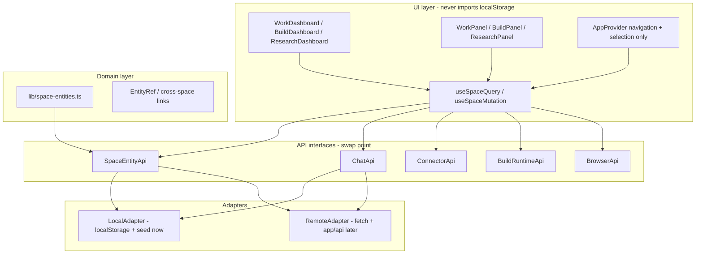
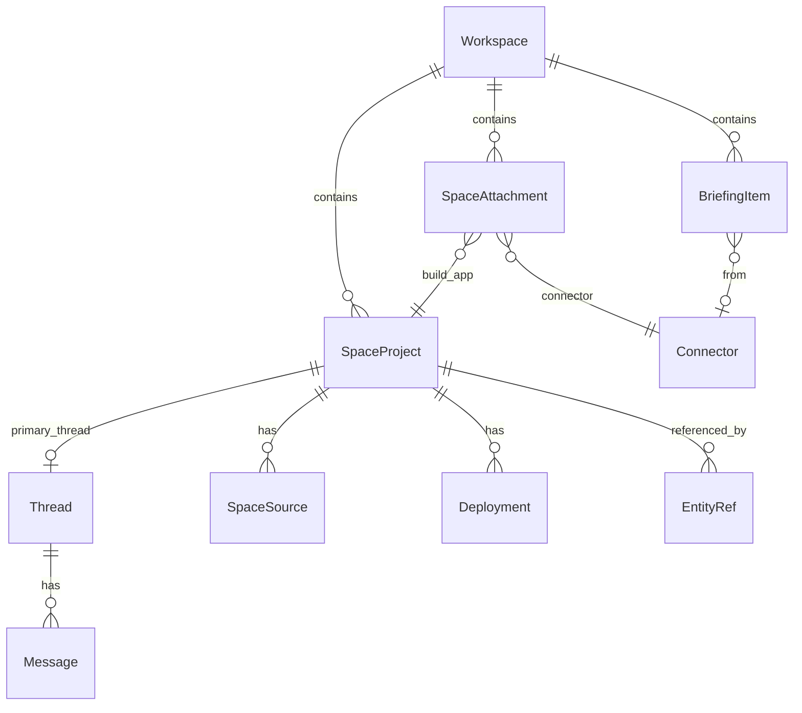
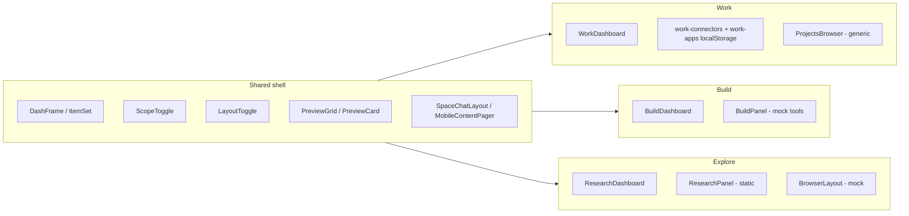

# Work · Build · Explore Space Refactor Plan

## Why this plan exists

Make **Work**, **Build**, and **Explore** genuinely usable *before* backend work—while ensuring every UI surface reads/writes through **repository interfaces** that a real API can implement later without a rewrite.

Today all three spaces share a strong visual shell but behave mostly as **chat prompt launchers over static seed data** (`lib/data.ts`, scattered localStorage). The refactor fixes user-facing flows on **web, desktop, and mobile** using existing design language, and **locks in a data boundary** so backend is a swap, not a migration fire drill.

### What users hate about ChatGPT / Claude (and how Cander should differ)

| Pain point | ChatGPT / Claude complaint | Cander opportunity |
|---|---|---|
| Project discoverability | Clicking a project only expands chats; files buried in chat | **Space home is one tap** — add **entity detail** routes from cards |
| Files & sources | Read-only, flat lists, unreliable export | **Sources library** with folders, preview, export, cross-space actions |
| Context fragmentation | Desktop vs web show different project lists | **One workspace model** via API layer + shared entity IDs |
| Research → output gap | Artifacts don't round-trip into projects | **Reference pipeline** with persisted `EntityRef` records |
| Disposable chats | Every thread starts from zero | **Project ↔ Thread** link + instructions on entity open |
| Connector/work split | N/A | **Work as operational hub**: connectors + Build apps + automations |

---

## Backend-first architecture (read this first)

This is the **non-negotiable shape** for all phases. UI work that bypasses it creates backend debt.

### Layer diagram



### Hard rules (enforce in code review)

1. **Components never import** `localStorage`, `lib/data.ts` seed arrays, or store persist helpers directly.
2. **AppProvider owns routing/selection only** — `view`, `spaceId`, `projectId`, `threadId`, `mobileSurface`, `openSpaceEntity()`. Not CRUD.
3. **All reads go through** `useSpaceQuery(key, fetcher)` — returns `{ data, isLoading, error, refetch }`.
4. **All writes go through** `useSpaceMutation(mutation)` — supports optimistic updates + rollback.
5. **Every entity has** `id`, `workspaceId`, `createdAt`, `updatedAt`, `version` (integer for conflict detection).
6. **IDs are stable strings** — UUID-shaped even in local adapter (`crypto.randomUUID()`), never array indices.
7. **Cross-space links use** `EntityRef { type, id, space, workspaceId }` — never composer string hacks long-term.

### SpaceDataProvider

New `[components/app/SpaceDataProvider.tsx](components/app/SpaceDataProvider.tsx)` wraps the app (inside `AppProvider` or sibling):

```typescript
// Injected once; toggled by env or feature flag later
const adapter = process.env.NEXT_PUBLIC_USE_REMOTE_API
  ? remoteSpaceEntityApi
  : localSpaceEntityApi;

<SpaceDataProvider apis={{ space: adapter, chat, connector, build, browser }}>
  {children}
</SpaceDataProvider>
```

Components call `useSpaceApis()` — never `localSpaceEntityApi` directly.

---

## Data model (backend-aligned)

### Core entities

| Entity | Key fields | Relationships |
|---|---|---|
| `SpaceProject` | id, space, workspaceId, title, summary, cover, status, kind, instructions, threadId, publishedUrl?, version | 1 project → 1 primary thread; N sources; N deployments |
| `SpaceSource` | id, projectId?, space, workspaceId, title, kind, url?, fileId?, folderId, citationMeta, version | belongs to Explore project or floats in workspace library |
| `BriefingItem` | id, workspaceId, connectorId?, tone, title, summary, actionType, externalId?, snoozedUntil?, version | Work Today feed; `externalId` maps to Gmail/Calendar row later |
| `SpaceAttachment` | id, workspaceId, kind (connector\|buildApp\|automation), targetId | Work Apps surface |
| `Deployment` | id, projectId, url, status, createdAt | Build publish history |
| `EntityRef` | type, id, space, workspaceId, label?, snapshot? | composer attachment; persisted |
| `Thread` | id, spaceId, workspaceId, projectId?, title, version | chat history container |
| `Message` | id, threadId, role, content, blocks, createdAt | existing shape; add threadId index |

### Entity relationship diagram



### Chat ↔ Entity linking (critical for backend)

Today [`lib/persistent-chat.ts`](lib/persistent-chat.ts) creates space threads independently of projects. **Unify:**

- `SpaceProject.threadId` is the canonical chat for that project.
- `newBuildProject()` → API creates project **and** thread atomically (local adapter: single transaction in memory).
- `openSpaceEntity()` → sets `threadId` from project; panel + chat stay in sync.
- Space-level home chat (no project) keeps existing `t-space-{workspaceId}-{space}` continuous thread.
- Messages API: `ChatApi.listMessages(threadId)`, `ChatApi.sendMessage(threadId, content, { refs: EntityRef[] })`.

When backend arrives, thread + project creation becomes one POST; UI already expects that.

---

## API interfaces (define in Phase 0, implement local first)

### SpaceEntityApi — `[lib/api/space-entity-api.ts](lib/api/space-entity-api.ts)`

```typescript
interface SpaceEntityApi {
  // Projects
  listProjects(ctx: WorkspaceCtx, space: SpaceId, filter?: ProjectFilter): Promise<SpaceProject[]>
  getProject(ctx: WorkspaceCtx, id: string): Promise<SpaceProject | null>
  createProject(ctx: WorkspaceCtx, input: CreateProjectInput): Promise<SpaceProject>
  updateProject(ctx: WorkspaceCtx, id: string, patch: UpdateProjectPatch): Promise<SpaceProject>
  deleteProject(ctx: WorkspaceCtx, id: string): Promise<void>

  // Sources
  listSources(ctx: WorkspaceCtx, opts?: SourceFilter): Promise<SpaceSource[]>
  createSource(ctx: WorkspaceCtx, input: CreateSourceInput): Promise<SpaceSource>
  updateSource(ctx: WorkspaceCtx, id: string, patch: UpdateSourcePatch): Promise<SpaceSource>
  deleteSource(ctx: WorkspaceCtx, id: string): Promise<void>

  // Work
  listBriefingItems(ctx: WorkspaceCtx, filter?: BriefingFilter): Promise<BriefingItem[]>
  mutateBriefingItem(ctx: WorkspaceCtx, id: string, action: BriefingAction): Promise<BriefingItem>

  // Attachments & cross-space
  listAttachments(ctx: WorkspaceCtx): Promise<SpaceAttachment[]>
  attachToWork(ctx: WorkspaceCtx, ref: EntityRef): Promise<SpaceAttachment>
  detachFromWork(ctx: WorkspaceCtx, attachmentId: string): Promise<void>
  linkReference(ctx: WorkspaceCtx, ref: EntityRef, target: EntityRef): Promise<void>

  // Deployments
  listDeployments(ctx: WorkspaceCtx, projectId: string): Promise<Deployment[]>
  createDeployment(ctx: WorkspaceCtx, projectId: string, input: CreateDeploymentInput): Promise<Deployment>
}
```

`WorkspaceCtx = { workspaceId: string; actorId: string }` — **every call scoped**; mirrors future auth headers.

### ChatApi — `[lib/api/chat-api.ts](lib/api/chat-api.ts)`

```typescript
interface ChatApi {
  listThreads(ctx: WorkspaceCtx, filter?: ThreadFilter): Promise<Thread[]>
  getThread(ctx: WorkspaceCtx, id: string): Promise<Thread | null>
  createThread(ctx: WorkspaceCtx, input: CreateThreadInput): Promise<Thread>
  listMessages(ctx: WorkspaceCtx, threadId: string): Promise<Message[]>
  sendMessage(ctx: WorkspaceCtx, threadId: string, input: SendMessageInput): Promise<Message>
  // Later: streamMessage(), cancelGeneration()
}
```

Local adapter wraps existing `AppProvider` thread state initially, then migrates threads into store/API.

### ConnectorApi — `[lib/api/connector-api.ts](lib/api/connector-api.ts)`

```typescript
interface ConnectorApi {
  listAvailable(ctx: WorkspaceCtx): Promise<Connector[]>
  listAttached(ctx: WorkspaceCtx, target: 'work' | 'build'): Promise<string[]>
  attach(ctx: WorkspaceCtx, connectorId: string, target: 'work' | 'build'): Promise<void>
  detach(ctx: WorkspaceCtx, connectorId: string, target: 'work' | 'build'): Promise<void>
  syncBriefing(ctx: WorkspaceCtx): Promise<BriefingItem[]>  // no-op locally; real sync later
  openConnectorSession(ctx: WorkspaceCtx, connectorId: string): Promise<ConnectorSession>
}
```

Wraps [`lib/work-connectors.ts`](lib/work-connectors.ts) + Connectors dashboard today.

### BuildRuntimeApi — `[lib/api/build-runtime-api.ts](lib/api/build-runtime-api.ts)`

```typescript
interface BuildRuntimeApi {
  getPreviewUrl(ctx: WorkspaceCtx, projectId: string): Promise<PreviewSession | null>
  listFiles(ctx: WorkspaceCtx, projectId: string): Promise<ProjectFile[]>
  getFileContent(ctx: WorkspaceCtx, projectId: string, path: string): Promise<string>
  saveFileContent(ctx: WorkspaceCtx, projectId: string, path: string, content: string): Promise<void>
  publish(ctx: WorkspaceCtx, projectId: string, input: PublishInput): Promise<Deployment>
  // Later: terminalSession(), gitStatus(), runCommand()
}
```

Local adapter returns mock URLs/content from seed; UI treats response identically to future real session.

### BrowserApi — `[lib/api/browser-api.ts](lib/api/browser-api.ts)`

```typescript
interface BrowserApi {
  navigate(url: string): Promise<BrowserPage>
  captureReference(ctx: WorkspaceCtx, page: BrowserPage): Promise<SpaceSource>
  // Later: proxyFetch(), screenshot(), extractReadable()
}
```

---

## Async UX contract (build now, required for backend)

Every dashboard and panel that reads API data **must** handle four states:

| State | UI pattern |
|---|---|
| **Loading** | Skeleton cards/rows (reuse existing muted blocks; no spinners everywhere) |
| **Empty** | Scope-specific copy via `emptyCopy(scope)` — already started in work-catalog |
| **Error** | Inline retry banner; don't silent-fail to seed data |
| **Success** | Grid/list from API data |

Mutations (create project, attach source, publish):

1. **Optimistic** — update cache immediately via `useSpaceMutation`
2. **Confirm** — replace optimistic row with server response (+ version bump)
3. **Rollback** — on error, revert optimistic state + toast

This means local adapter should optionally simulate latency (`await delay(80)`) behind a dev flag to stress-test UI before backend exists.

---

## Future backend mapping (Phase 6 — not built now, but shapes Phase 0)

When backend lands, each API maps to Next.js routes or a BFF:

| API method | Future route (example) |
|---|---|
| `listProjects` | `GET /api/workspaces/:id/projects?space=build` |
| `createProject` | `POST /api/workspaces/:id/projects` |
| `listMessages` | `GET /api/threads/:id/messages` |
| `sendMessage` | `POST /api/threads/:id/messages` (+ SSE stream) |
| `syncBriefing` | `POST /api/workspaces/:id/work/briefing/sync` |
| `attach` (connector) | `POST /api/workspaces/:id/connectors/:cid/attach` |
| `publish` | `POST /api/projects/:id/deployments` |
| `captureReference` | `POST /api/workspaces/:id/sources/from-url` |

**RemoteAdapter** = thin `fetch` wrapper with auth cookie/header, error normalization, and Zod validation at the boundary.

### localStorage → server migration

On first authenticated session after backend ships:

1. `MigrationService.scanLocal()` — read legacy keys (`courier-work-connectors`, new store keys, threads)
2. `POST /api/migrate` — idempotent upload; server returns ID mapping `{ localId → serverId }`
3. Client rewrites local refs once, then disables LocalAdapter for that workspace
4. Keep LocalAdapter for offline/demo mode via feature flag

Document migration in `[lib/api/migration.ts](lib/api/migration.ts)` stub during Phase 0.

---

## Current state (baseline)



**Gaps:** no repository boundary; AppProvider holds threads + projects + routing; seed data imported in components; no loading/error states.

---

## Target UX contract (same across all three spaces)

1. **Space home:** banner + scopes + grid + primary CTA
2. **Card click:** open entity detail via `openSpaceEntity()` — not always `sendMessage(prompt)`
3. **Entity open:** chat (linked thread) + panel (space-specific surface)
4. **Overflow actions:** Open · Ask · Add to Work · Use in Build · Pin — all call API mutations
5. **Mobile / desktop:** same entity IDs, same API calls; layout differs only

### Unified dashboard header

| Element | Work | Build | Explore |
|---|---|---|---|
| Title | Work | Build | Explore |
| Primary CTA | Ask | New build | Ask / Browse |
| Scopes | Today · Apps · Automations | All · Projects · Apps · Sites · Automations | All · Projects · Research · Reports · Sources |

---

## Phase 0 — Foundation (BLOCKING — backend-ready layer)

**Goal:** Repository interfaces + local adapters + hooks + navigation split. **Nothing in Phases 1–5 ships without Phase 0.**

### 0a. Entity types — `[lib/space-entities.ts](lib/space-entities.ts)`

All entities include: `id`, `workspaceId`, `createdAt`, `updatedAt`, `version`.

Define: `SpaceProject`, `SpaceSource`, `BriefingItem`, `SpaceAttachment`, `Deployment`, `EntityRef`, `Thread`, `Message` (extend existing), input/patch types, `WorkspaceCtx`.

Migrate seed data from [`lib/data.ts`](lib/data.ts) into **local adapter seed initializer** — not imported by UI.

### 0b. API interfaces + LocalAdapter — `lib/api/*`

- `space-entity-api.ts` — interface
- `space-entity-api.local.ts` — localStorage + in-memory, implements full interface
- `space-entity-api.remote.ts` — stub throwing `NotImplementedError` until Phase 6
- Same pattern for `chat-api`, `connector-api`, `build-runtime-api`, `browser-api`

Refactor [`work-connectors.ts`](lib/work-connectors.ts) and [`work-apps.ts`](lib/work-apps.ts) to be **implementation details inside** `connector-api.local.ts` — public surface is ConnectorApi only.

### 0c. SpaceDataProvider + hooks

- `[components/app/SpaceDataProvider.tsx](components/app/SpaceDataProvider.tsx)`
- `[lib/hooks/use-space-query.ts](lib/hooks/use-space-query.ts)` — wraps `useSyncExternalStore` + async fetch + cache key per workspace
- `[lib/hooks/use-space-mutation.ts](lib/hooks/use-space-mutation.ts)` — optimistic update helper

### 0d. AppProvider split

**Keep in AppProvider:** `view`, `spaceId`, `projectId`, `threadId`, `mobileSurface`, navigation callbacks.

**Move out (to ChatApi / SpaceEntityApi):** thread list mutations, project CRUD, message send implementation.

Add navigation helpers (thin wrappers):

- `openSpaceEntity(space, entityId, opts?)` — reads project via API, sets selection state
- `attachReference(ref)` — `ChatApi` + `SpaceEntityApi.linkReference`
- `promoteToWork(ref)` / `promoteToBuild(ref)` — API mutations

### 0e. Shared card actions + dashboard migration

- Extend [`PreviewCard.tsx`](components/spaces/PreviewCard.tsx) — overflow actions call mutations
- Dashboards use `useSpaceQuery(['projects', space, workspaceId], () => api.listProjects(...))`
- **Exit criteria:** zero direct seed imports in `components/spaces/*`; all CRUD through API; loading/empty/error visible

---

## Phase 1 — Work space refactor

**Goal:** Operational hub — connectors, briefing, Build app launcher.

### 1a. WorkPanel — `[components/panels/WorkPanel.tsx](components/panels/WorkPanel.tsx)`

| Tab | Data source |
|---|---|
| Briefing | `ConnectorApi.syncBriefing()` → `BriefingItem[]` (mock templates locally) |
| Apps | `ConnectorApi.listAttached('work')` + `SpaceEntityApi.listAttachments()` |
| Automations | `SpaceEntityApi.listProjects(filter: automation)` |
| Library | `SpaceEntityApi.listSources()` folder tree |

### 1b. Work dashboard

- Today cards → `openSpaceEntity('work', itemId)` or briefing detail route
- Empty Apps → `ConnectorApi.attach` flow
- Areas settings toggles → `BriefingFilter` passed to API

### 1c. Entitlements

Enforce `canUseWorkSpace` in [`spaceAllowed()`](lib/spaces.ts) + sidebar.

**Backend note:** `BriefingItem.externalId` + `connectorId` are the join keys for Gmail/Calendar sync later.

---

## Phase 2 — Build space refactor

**Goal:** Create → preview → publish → add to Work.

### 2a. Creation via API

- `New ▾` menu → `SpaceEntityApi.createProject({ kind: 'app' | 'site' | 'automation' })`
- API creates project + thread atomically; navigates to split view

### 2b. Build panel tiering

Essential: Preview · Overview · Activity · Files · Publish — all read via `BuildRuntimeApi`.

Advanced: Editor · Terminal · Git · etc. — mock locally, same interface.

### 2c. Publish

- `BuildRuntimeApi.publish()` → `Deployment` record
- Dashboard badge from `listDeployments` — not static seed

**Backend note:** `PreviewSession.url` becomes real dev server URL; `ProjectFile` paths map to object storage.

---

## Phase 3 — Explore space refactor

**Goal:** Browse → save sources → reports → feed Build/Work.

### 3a. BrowserEngine + BrowserApi

- Extract [`BrowserEngine.tsx`](components/browser/BrowserEngine.tsx)
- `BrowserApi.captureReference()` → `SpaceEntityApi.createSource()`

### 3b. Explore project panel

Tabs backed by API: sources, notes (stored as `SpaceSource` kind=note), report sections (kind=report, structured JSON in `citationMeta`).

### 3c. Reference chips

[`ReferenceChip.tsx`](components/shell/ReferenceChip.tsx) — persisted `EntityRef`; send via `ChatApi.sendMessage({ refs })`.

**Backend note:** Source ingestion endpoint replaces local capture; report export becomes server PDF/MD generation.

---

## Phase 4 — Cross-space integration

- **Recents / Search / Pins** — query `SpaceEntityApi` + `ChatApi` with unified index keys
- **promoteToWork / promoteToBuild** — explicit API mutations creating attachment/link records
- **Space library** — `listSources({ folderId })` + `listProjects({ space })`

---

## Phase 5 — Platform parity (web · desktop · mobile)

Same API calls on all shells. Async UX (skeleton/error/retry) on mobile too — backend latency will hit mobile first.

Entity back stack in [`MobileAppChrome.tsx`](components/shell/MobileAppChrome.tsx) for deep panel navigation.

---

## Phase 6 — Backend rollout (future — interfaces already exist)

This phase **implements RemoteAdapters** — no UI rewrites if Phase 0 was done correctly.

### 6a. API routes + auth

- Next.js `app/api/**` routes matching table above
- Session auth; every handler validates `workspaceId` membership
- Optimistic locking via `version` field on PATCH

### 6b. Real services (incremental)

| Service | Replaces |
|---|---|
| Connector sync worker | `ConnectorApi.syncBriefing` mock templates |
| Build dev server manager | `BuildRuntimeApi.getPreviewUrl` mock |
| Deploy pipeline | `BuildRuntimeApi.publish` local record |
| Browser proxy / WebView | `BrowserApi.navigate` mock page |
| Chat agent streaming | `ChatApi.sendMessage` mock reply in build-loop |

### 6c. Migration + dual-write period

- Run `MigrationService` on login
- Feature flag: `USE_REMOTE_API` per workspace
- Dual-write optional during transition (local + remote) — then disable local

### 6d. Validation checklist before flipping flag

- [ ] All dashboards load from RemoteAdapter without seed imports
- [ ] Create project → thread link preserved across refresh
- [ ] Cross-space attach survives reload
- [ ] Optimistic mutations rollback correctly on 409/500
- [ ] Mobile + desktop + web pass same smoke flows

---

## Recommended implementation order

1. **Phase 0** — API interfaces, LocalAdapters, SpaceDataProvider, hooks, AppProvider split (**blocking**)
2. **Phase 2 Build** — creation/publish loop validates project+thread+deployment API
3. **Phase 3 Explore** — sources/refs validate capture + cross-space mutations
4. **Phase 1 Work** — briefing + attachments consume Build/Connector APIs
5. **Phase 4** — cross-space search/recents
6. **Phase 5** — platform parity + async UX hardening
7. **Phase 6** — RemoteAdapter + routes (when ready for backend)

---

## Files most touched

| Area | Primary files |
|---|---|
| **API layer (new)** | `lib/api/space-entity-api.ts`, `lib/api/*.local.ts`, `lib/space-entities.ts`, `lib/hooks/use-space-query.ts` |
| Provider | `components/app/SpaceDataProvider.tsx`, slimmed `AppProvider.tsx` |
| Shared shell | `ItemSet.tsx`, `PreviewCard.tsx`, `SpaceChatLayout.tsx`, `ContextPanel.tsx` |
| Work | `WorkDashboard.tsx`, new `WorkPanel.tsx` |
| Build | `BuildDashboard.tsx`, `BuildPanel.tsx`, `PreviewChrome.tsx` |
| Explore | `ResearchDashboard.tsx`, `ResearchPanel.tsx`, new `BrowserEngine.tsx` |
| Mobile | `MobileAppChrome.tsx`, `MobilePanelActions.tsx` |

---

## Out of scope until Phase 6

- Live connector OAuth + sync workers
- Real dev server / terminal / git processes
- Real DNS + deploy pipeline
- Live web rendering (proxy/WebView security model)
- Multiplayer / version control

UI and LocalAdapters **must not assume these are impossible** — show pending/syncing states where relevant.

---

## Success metrics

### Usability (now, local adapter)

- **Work:** connect app → Apps list → launch → briefing in ≤4 taps (mobile)
- **Build:** New app → dashboard → preview → publish badge → Add to Work
- **Explore:** Browse → save source → Use in Build with reference chip

### Backend readiness (before Phase 6 ships)

- Zero `localStorage` imports in `components/**`
- Zero direct `lib/data.ts` imports in `components/**`
- `RemoteAdapter` can be wired behind flag without changing dashboards
- Every entity CRUD has a corresponding route stub documented
- Chat send accepts `EntityRef[]` and persists refs
